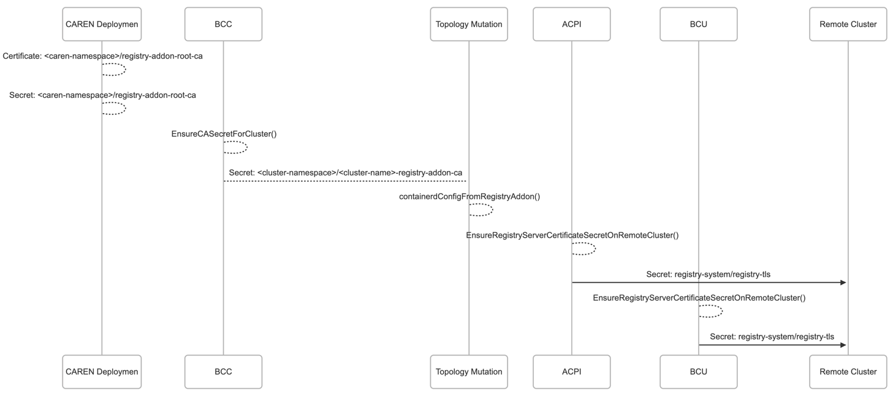

+++
title = "Registry"
icon = "fa-solid fa-cubes"
+++

By leveraging CAPI cluster lifecycle hooks, this handler deploys an OCI [Distribution] registry,
at the `AfterControlPlaneInitialized` phase and configures it as a mirror on the new cluster.
The registry will be deployed as a StatefulSet with a persistent volume claim for storage
and multiple replicas for high availability.
A sidecar container in each Pod running [Regsync] will periodically sync the OCI artifacts across all replicas.

Deployment of this registry is opt-in via the [provider-specific cluster configuration]().

The hook will use the [Cluster API Add-on Provider for Helm] to deploy the registry resources.

## Example

To enable deployment of the registry on a cluster, specify the following values:

```yaml
apiVersion: cluster.x-k8s.io/v1beta1
kind: Cluster
metadata:
  name: <NAME>
spec:
  topology:
    variables:
      - name: clusterConfig
        value:
          addons:
            registry: {}
```

## Registry Certificate

1. A root CA Certificate is deployed in the provider's namespace.
2. cert-manager generates a 10-year self-signed root Certificate
   and creates a Secret `registry-addon-root-ca` in the provider's namespace.
3. BCC handler copies `ca.crt` from the `registry-addon-root-ca` Secret
   to a new cluster Secret `<cluster-name>-registry-addon-ca`.
   A client pushing to the registry can use either the root CA Secret or the cluster Secret to trust the registry.
4. The cluster CA Secret contents (`ca.crt`) is written out as files on the Nodes
   and used by Containerd to trust the registry addon.
5. During the initial cluster creation, the ACPI handler uses the root CA to create a new 2-year server certificate
   for the registry and creates a Secret `registry-tls` on the remote cluster.
6. During cluster upgrades, the BCU handler renews the server certificate
   and updates the Secret `registry-tls` on the remote cluster with the new certificate.
   It is expected that clusters will be upgraded at least once every 2 years to avoid certificate expiration.



[Distribution]: https://github.com/distribution/distribution
[Cluster API Add-on Provider for Helm]: https://github.com/kubernetes-sigs/cluster-api-addon-provider-helm
[Regsync]: https://regclient.org/usage/regsync/
